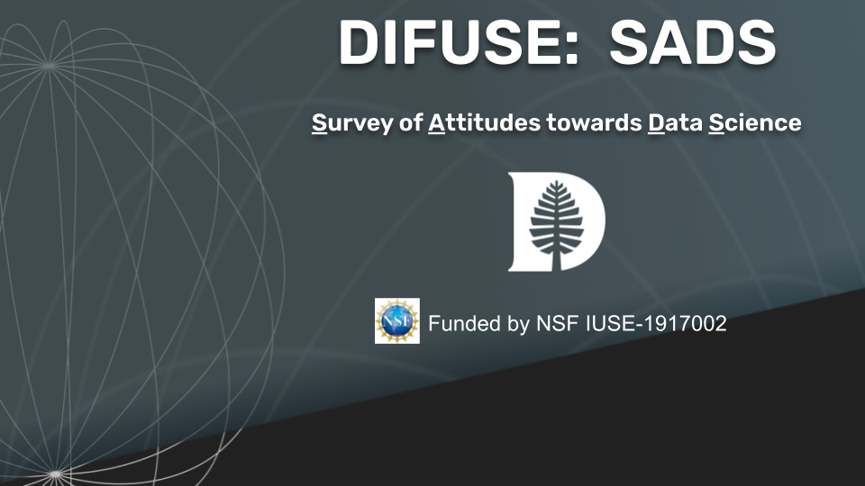

This survey was developed by Mandy Li, Scott Pauls, and Olivia Szendey through the DIFUSE project at Dartmouth College and funded by the National Science Foundation award IUSE-1917002.

 This work is licensed under a <a rel="license" href="http://creativecommons.org/licenses/by-sa/4.0/">Creative Commons Attribution-ShareAlike 4.0 International License</a>.

Please cite the survey as 
Li, Z., Pauls, S., Szendey, O. (2018) *Survey of Attitudes towards Data Science*, doi: 10.5281/zenodo.6884050

